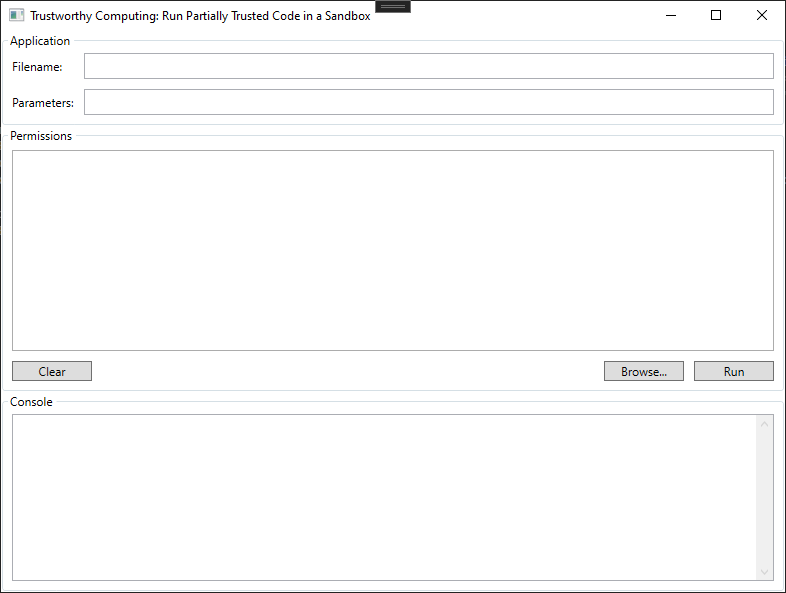

# Trustworthy Computing: Run Partially Trusted Code in a Sandbox

## Introduction

The application is designed to utilise the .NET Framework's provided mechanism for the enforcement of varying levels of trust on different code running in the same application called Code Access Security (CAS).

Sandboxing is the practice of running code in a restricted security environment, which limits the access permissions granted to the code. For example, if you have a managed library from a source you do not completely trust, you should not run it as fully trusted. Instead, you should place the code in a sandbox that limits its permissions to those that you expect it to need (for example, Execution permission). [How to: Run Partially Trusted Code in a Sandbox](https://docs.microsoft.com/en-us/previous-versions/dotnet/framework/code-access-security/how-to-run-partially-trusted-code-in-a-sandbox)

## Application Summary

Below is a provided screenshot of the application and a table which explained the individual components of the interface.

| Section       | Description   |
| ------------- |:--------------------------------------------------------------------:|
| Filename      |                                                                      |
| Parameters    |                                                                      |
| Premissions   |                                                                      |
| Clear         |                                                                      |
| Browse        |                                                                      |
| Run           |                                                                      |
| Console       |                                                                      |